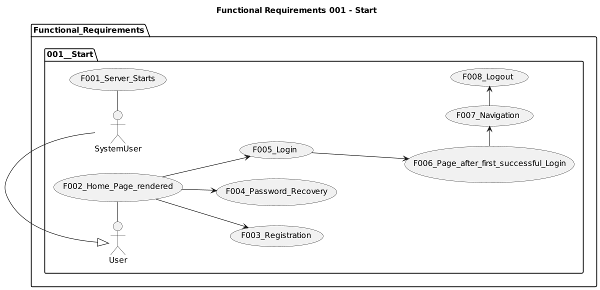
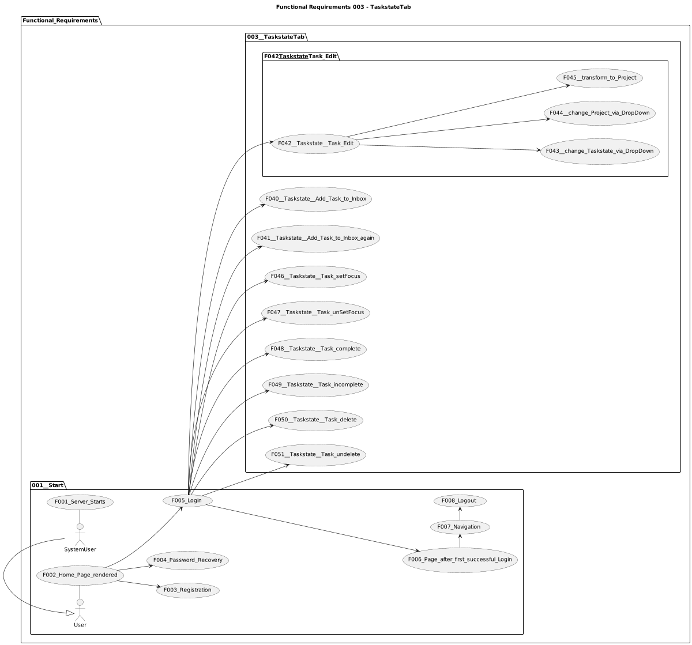
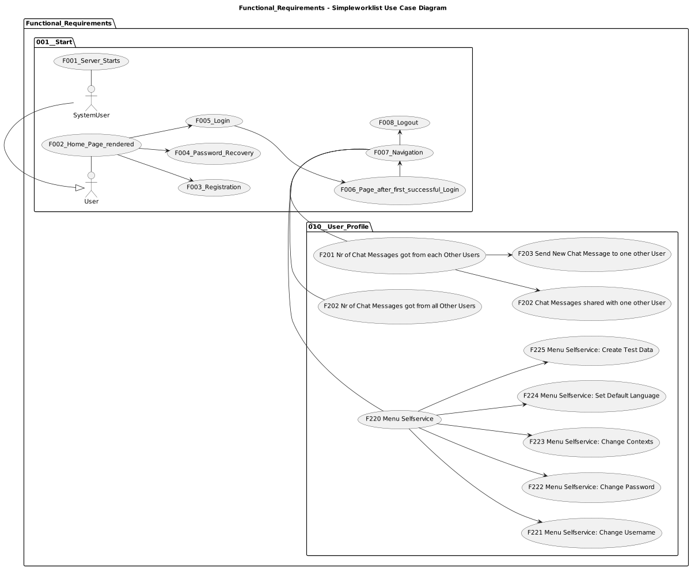

# simpleworklist

Your Todo List for Getting Things Done

## Getting Things Done
* GTD&reg; and Getting Things Done&reg; are registered trademarks of the David Allen Company. 
* SimpleWorklist is not affiliated with or endorsed by the David Allen Company.

## Development
* [CHANGELOG](src/site/markdown/CHANGELOG.md)
* [TODO](src/site/markdown/TODO.md)

## URLs:
* Heroku Deployment: [simpleworklist.herokuapp.com/](https://simpleworklist.herokuapp.com/)
* For Developers: [localhost:8080](http://localhost:8080/)

## Nonfunctional Requirements
* [Nonfunctional Requirements](src/site/markdown/REQUIREMENTS_NONFUNCTIONAL.md)

## Functional Requirements
* [Functional Requirements](src/site/markdown/REQUIREMENTS_FUNCTIONAL.md)

### Functional Requirements 001 - Start

#### F001 Server Starts
#### F002 Home Page rendered
#### F003 Registration
#### F004 Password Recovery
#### F005 Login

#### F006 Page after first successful Login

#### F007 Logout

### Functional Requirements 002 - Show TaskstateTab

#### F010 show /taskstate/inbox

#### F011 show /taskstate/today

#### F012 show /taskstate/next

#### F013 show /taskstate/waiting

#### F014 show /taskstate/scheduled

#### F015 show /taskstate/someday

#### F016 show /taskstate/focus

#### F017 show /taskstate/completed

#### F018 show /taskstate/trash

#### F019 show /project/{projectid}

#### F020 show /taskstate/all

### Functional Requirements 003 - TaskstateTab

#### F040 Taskstate: Add Task to Inbox
#### F041 Taskstate: Add Task to Inbox again
#### F042 Taskstate: Task Edit
#### F043 Taskstate: Task Edit Form -> change Taskstate via DropDown
#### F044 Taskstate: Task Edit Form -> change Project via DropDown
#### F045 Taskstate: Task Edit Form -> transform to Project
#### F046 Taskstate: Task setFocus
#### F047 Taskstate: Task unSetFocus
#### F048 Taskstate: Task complete
#### F049 Taskstate: Task incomplete
#### F050 Taskstate: Task delete
#### F051 Taskstate: Task undelete

### Functional Requirements 004 - Project/Root

#### F060 Project/Root: Add Task
#### F061 Project/Root: Add SubProject
#### F062 Project/Root: Task Edit
#### F063 Project/Root: Task Edit Form -> change Taskstate via DropDown
#### F064 Project/Root: Task Edit Form -> change Project via DropDown
#### F065 Project/Root: Task Edit Form -> transform to Project
#### F066 Project/Root: Task setFocus
#### F067 Project/Root: Task unSetFocus
#### F068 Project/Root: Task complete
#### F069 Project/Root: Task incomplete
#### F070 Project/Root: Task delete
#### F071 Project/Root: Task undelete

### Functional Requirements 005 - Project/id

#### F080 Project/id: Add Task
#### F081 Project/id: Add SubProject
#### F082 Project/id: Task Edit
#### F083 Project/id: Task Edit Form -> change Taskstate via DropDown
#### F084 Project/id: Task Edit Form -> change Project via DropDown
#### F085 Project/id: Task Edit Form -> transform to Project
#### F086 Project/id: Task setFocus
#### F087 Project/id: Task unSetFocus
#### F088 Project/id: Task complete
#### F089 Project/id: Task incomplete
#### F090 Project/id: Task delete
#### F091 Project/id: Task undelete

### Functional Requirements 006 - Drag and Drop. Task move to TaskstateTab

#### F120 Drag and Drop: Task move to /taskstate/inbox
#### F121 Drag and Drop: Task move to /taskstate/today
#### F122 Drag and Drop: Task move to /taskstate/next
#### F123 Drag and Drop: Task move to /taskstate/waiting
#### F124 Drag and Drop: Task move to /taskstate/scheduled
#### F125 Drag and Drop: Task move to /taskstate/someday
#### F126 Drag and Drop: Task move to /taskstate/focus
#### F127 Drag and Drop: Task move to /taskstate/completed
#### F128 Drag and Drop: Task move to /taskstate/trash

### Functional Requirements 007 - Drag and Drop Move to Project

#### F129 Drag and Drop: Task move to Project
#### F130 Drag and Drop: Project move to Project

### Functional Requirements 008 - Drag and Drop Move Task to Change Task-Order

#### F131 Drag and Drop: Move Task to Change Task-Order in TaskstateTab
#### F132 Drag and Drop: Move Task to Change Task-Order in Project/Root
#### F133 Drag and Drop: Move Task to Change Task-Order in Project/id

### Functional Requirements 009 - Pages
#### F140 Pages Information

### Functional Requirements 010 - Search

#### F200 Search Request

## Functional Requirements - User
### Functional Requirements 001 - Start

#### F003 Registration
#### F004 Password Recovery
#### F005 Login
#### F007 Logout

### Functional Requirements 011 - User Profile

#### F200 List of other Users and New Messages received from them

#### F201 Chat Messages shared with one other User

#### F202 Send New Chat Message to one other User

#### F220 Menu Selfservice: Change Username
#### F221 Menu Selfservice: Change Password
#### F222 Menu Selfservice: Change Contexts
#### F223 Menu Selfservice: Set Default Language
#### F224 Menu Selfservice: Create Test Data

### Functional Requirements 012 - On every Page behind Login

#### F250 Number of new incoming Messages from other Users

### Domain Class Modell
#### Domain Class Modell - Persistent

#### Domain Class Modell - Transient

## Software Design
### Service Classes Controller

### Service Classes DB data

### Service Classes DB user

### Service Classes Meso

