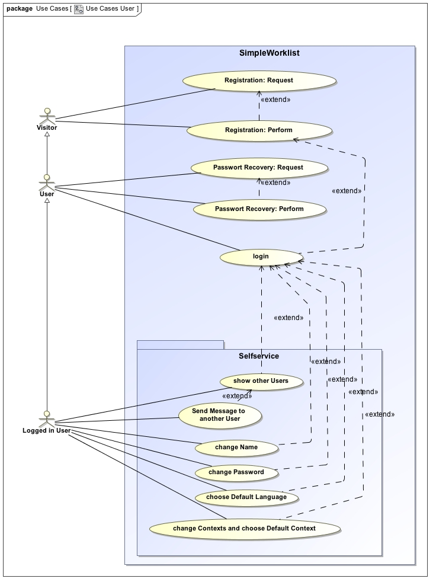
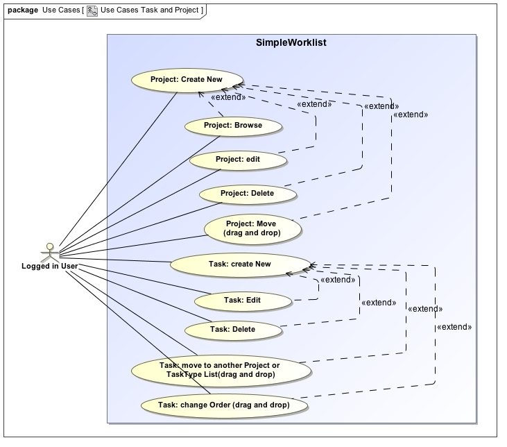
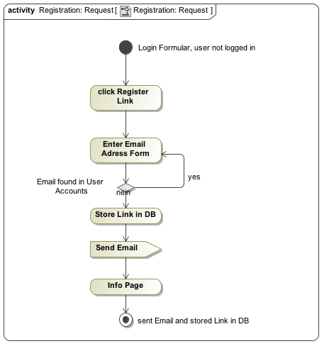
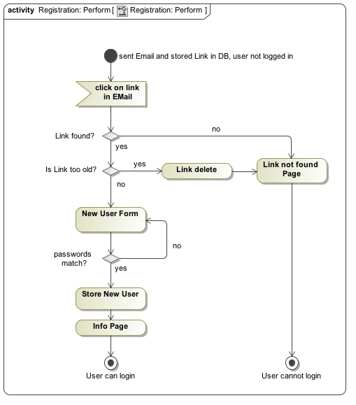
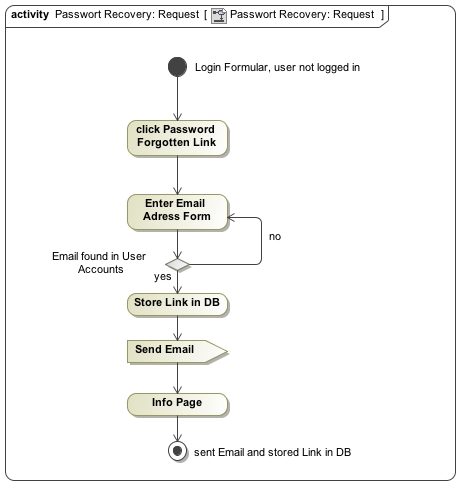
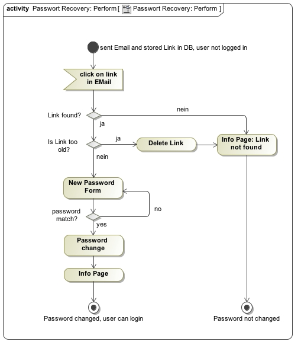
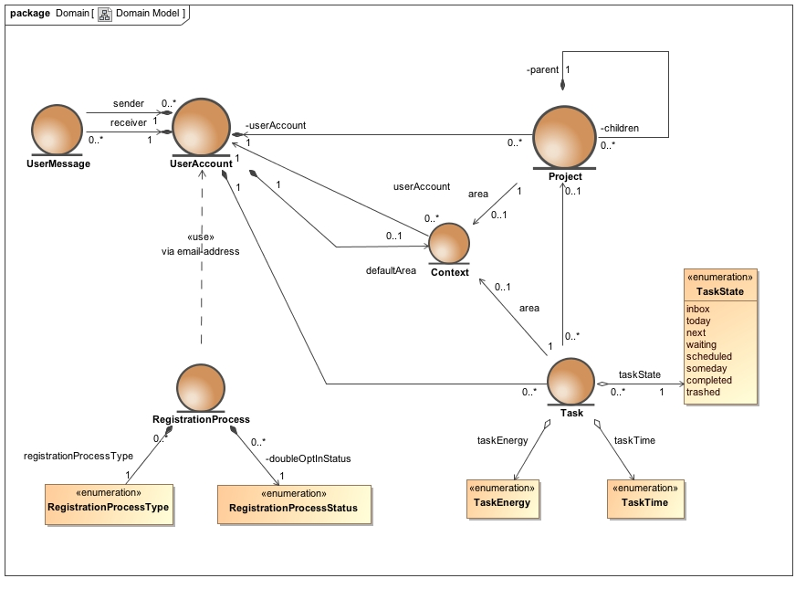
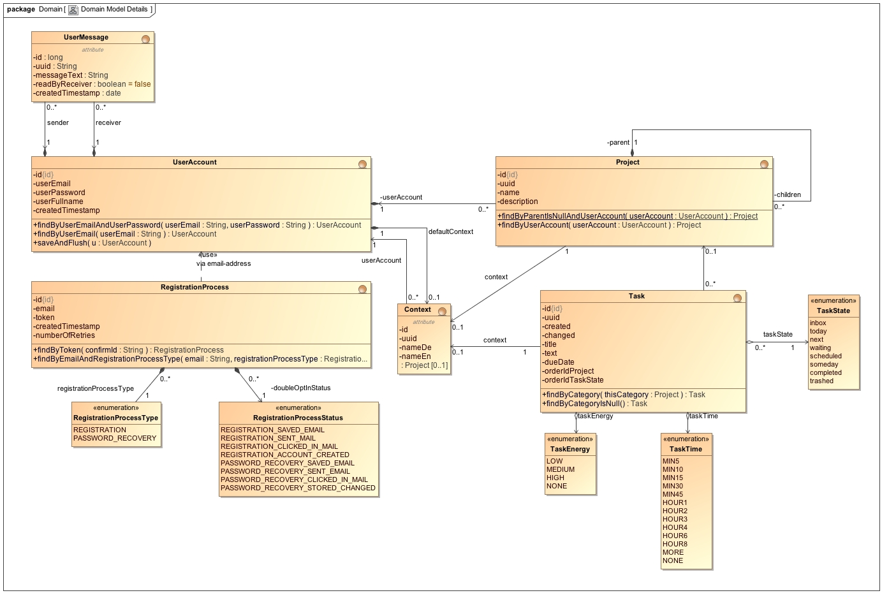
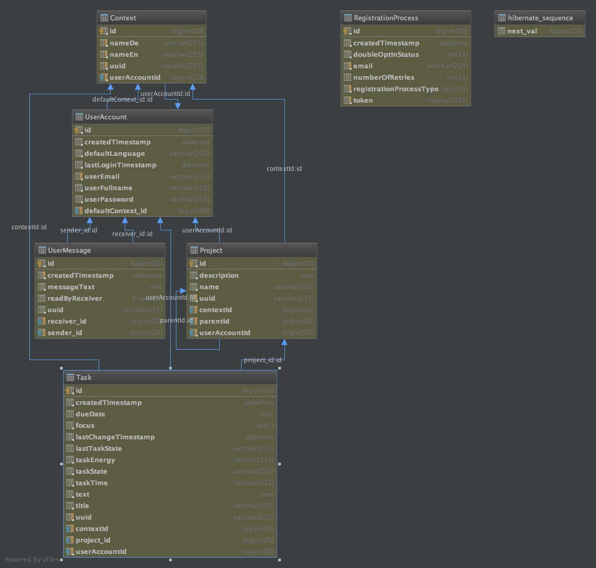

# SimpleWorklist
Your Todo-List for Getting Things Done

## Getting Things Done
GTD&reg; and Getting Things Done&reg; are registered trademarks of the David Allen Company. 
SimpleWorklist is not affiliated with or endorsed by the David Allen Company.

## Software-Stack: 
* [Spring-Boot](https://spring.io/projects/spring-boot/)
* [Spring Data JPA](https://spring.io/projects/spring-data-jpa)
* [Spring Session JDBC](https://spring.io/projects/spring-session-jdbc)
* [Spring MVC](https://docs.spring.io/spring/docs/current/spring-framework-reference/web.html)
* [Spring Security](https://spring.io/projects/spring-security)
* [Thymeleaf](https://github.com/thymeleaf/thymeleaf)
* [Bootstrap](https://getbootstrap.com/docs/4.4/getting-started/introduction/)
* [jQuery](http://jquery.com/) 
* HTML5 for Drag and Drop

## Development
* [Code Repository on Github](https://github.com/Spring-Framework-Java-Apps/simpleworklist)
* [Live Deployment on Heroku](https://simpleworklist.herokuapp.com/)

## TODO: Requirements
* See Files [Requirements.md](./Requirements.md) and [Nonfunctional_Requirements.md](./Nonfunctional_Requirements.md)

## Legacy Documentation: Requirements

### Legacy Documentation: Use Cases

#### User Selfservice

 
#### Tasks and Projects

### Use Case: User Self Registration
#### Figure Registration Request Activity

#### Figure Registration Perform Activity

#### Figure Registration Request Sequence

#### Figure Registration Perform Sequence

### Use Case: User Passwort Recovery
#### Figure Password Recovery Request

#### Figure Password Recovery Perform

### Domain Model
#### Entities

#### Domain Model Details

#### Database Schema

