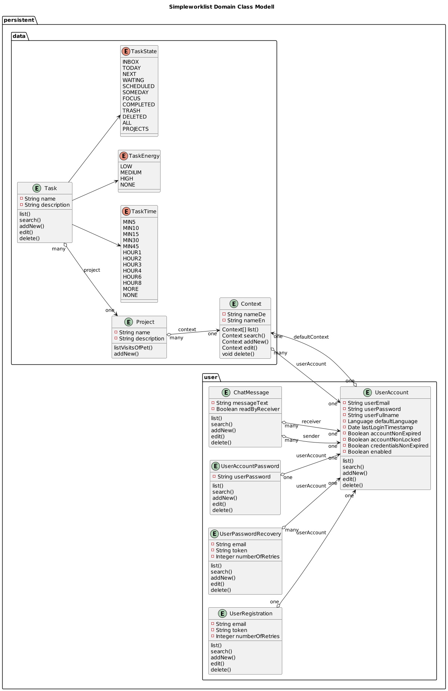
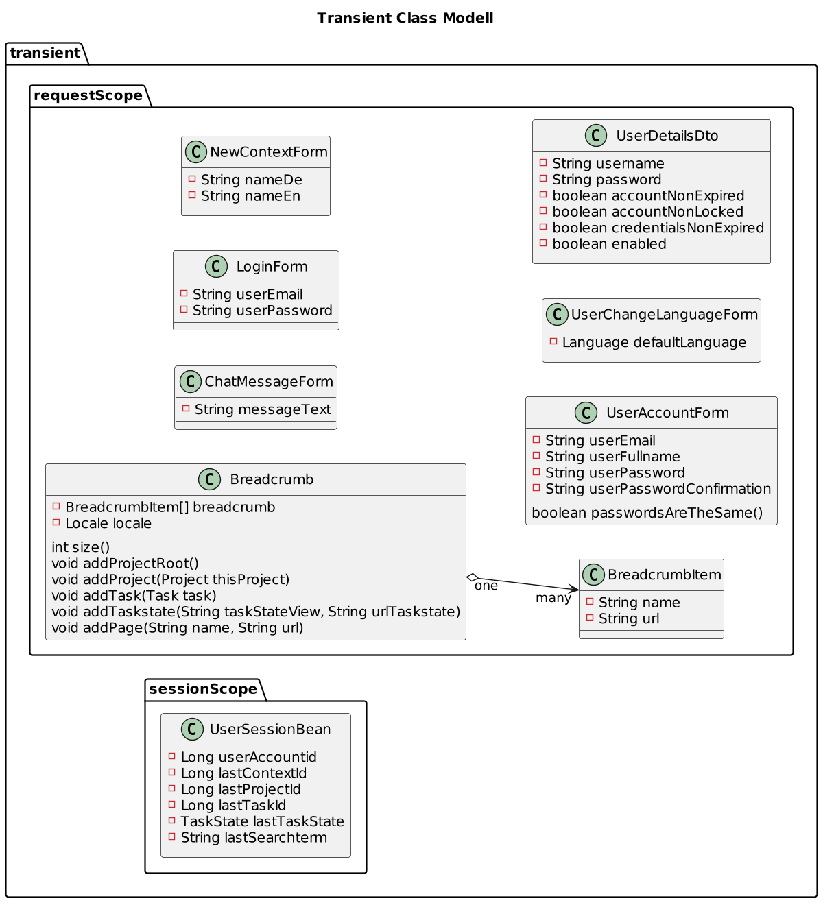
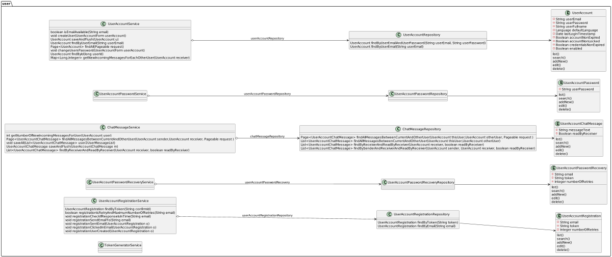
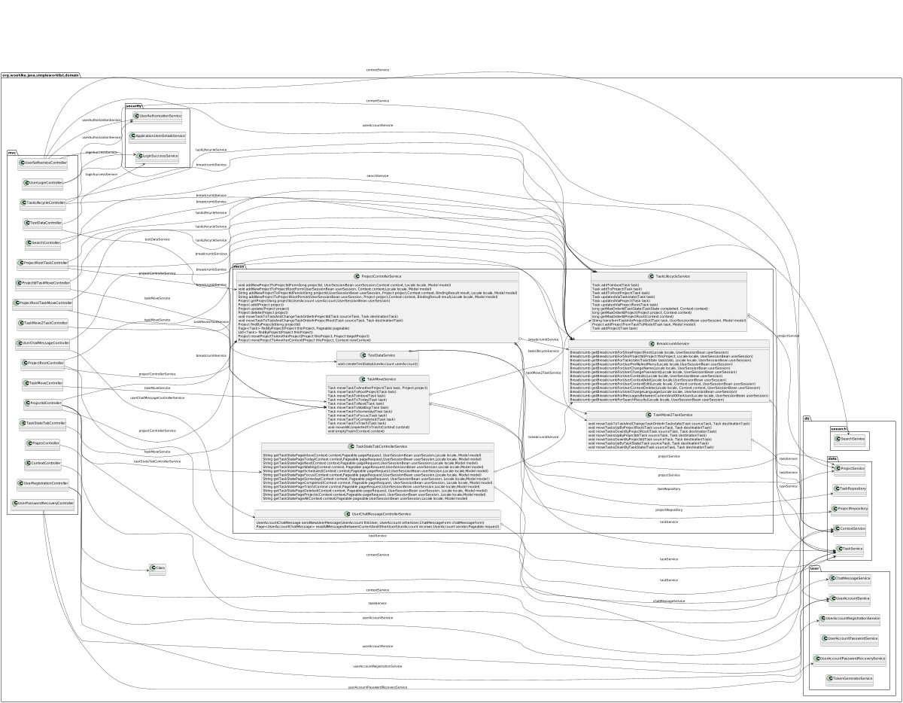

# simpleworklist

Your Todo List for Getting Things Done

## Getting Things Done
* GTD&reg; and Getting Things Done&reg; are registered trademarks of the David Allen Company.
* SimpleWorklist is not affiliated with or endorsed by the David Allen Company.

## Development
* [CHANGELOG](CHANGELOG.md)
* [TODO](TODO.md)

## URLs:
* Heroku Deployment: [simpleworklist.herokuapp.com/](https://simpleworklist.herokuapp.com/)
* For Developers: [localhost:8080](http://localhost:8080/)

## Nonfunctional Requirements
* [Nonfunctional Requirements](src/site/markdown/REQUIREMENTS_NONFUNCTIONAL.md)

### Domain Class Modell
#### Domain Class Modell - Persistent

#### Domain Class Modell - Transient

## Software Design
### Service Classes Controller

### Service Classes DB data

### Service Classes DB user

### Service Classes Meso

